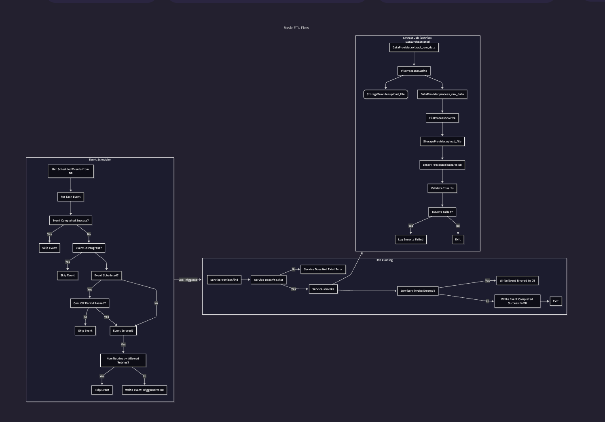
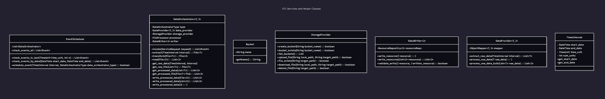

# Mining Raw Stat Data
## For Basketball Stats App

Version 0.1  
Prepared by Peter Connelly
2025-11-04

## Table of Contents
<!-- TOC -->
- [Mining Raw Stat Data](#mining-raw-stat-data)
  - [For Basketball Stats App](#for-basketball-stats-app)
  - [Table of Contents](#table-of-contents)
  - [Revision History](#revision-history)
  - [1. Introduction](#1-introduction)
    - [1.1 Document Purpose](#11-document-purpose)
    - [1.2 Subject Scope](#12-subject-scope)
    - [1.3 Definitions, Acronyms, and Abbreviations](#13-definitions-acronyms-and-abbreviations)
      - [1.3.1 Statistics](#131-statistics)
      - [1.3.2 Statistic Types](#132-statistic-types)
    - [1.4 References](#14-references)
    - [1.5 Document Overview](#15-document-overview)
  - [2. Design Overview](#2-design-overview)
    - [2.1 Data Sources](#21-data-sources)
      - [Potential Data Providers](#potential-data-providers)
      - [2.1.1 Provider Decision](#211-provider-decision)
    - [2.2 Schema Definitions](#22-schema-definitions)
      - [2.2.1 Teams and Players](#221-teams-and-players)
      - [2.2.2 Games](#222-games)
      - [2.2.3 Game-by-Game Stats](#223-game-by-game-stats)
        - [Counting Stats Schema](#counting-stats-schema)
        - [Aggregate Stats Schema](#aggregate-stats-schema)
        - [Advanced Stats Schema](#advanced-stats-schema)
    - [2.3 Data Scraping](#23-data-scraping)
      - [2.3.1 Basketball Reference Client Library](#231-basketball-reference-client-library)
        - [API](#api)
      - [2.3.2 Team Data](#232-team-data)
        - [Manual Entry](#manual-entry)
      - [2.3.3 Player Data](#233-player-data)
        - [Table: dim\_players\_nationalities](#table-dim_players_nationalities)
        - [Table: dim\_players](#table-dim_players)
        - [Table: dim\_positions](#table-dim_positions)
      - [2.3.4 Roster Data](#234-roster-data)
        - [Table: dim\_seasons](#table-dim_seasons)
        - [Table: dim\_rosters](#table-dim_rosters)
        - [Table: dim\_rosters\_players\_bios](#table-dim_rosters_players_bios)
      - [2.3.5 Game-by-Game Stats](#235-game-by-game-stats)
        - [Table: fact\_flat\_stats\_counting](#table-fact_flat_stats_counting)
        - [Table: dim\_stat\_offense\_scoring](#table-dim_stat_offense_scoring)
        - [Table: dim\_stat\_offense\_non\_scoring](#table-dim_stat_offense_non_scoring)
        - [Table: dim\_stat\_defense](#table-dim_stat_defense)
    - [2.4 ETL Flow](#24-etl-flow)
      - [2.4.1 Pipeline Tooling](#241-pipeline-tooling)
      - [2.4.2 Pipeline Design](#242-pipeline-design)
        - [Architecture](#architecture)
        - [Class Diagram](#class-diagram)
  - [3. Design Views](#3-design-views)
  - [4. Decisions](#4-decisions)
  - [5. Appendixes](#5-appendixes)
<!-- TOC -->

## Revision History

| Name | Date | Reason For Changes | Version |
|------|------|--------------------|---------|
|   Peter Connelly   | 2025-11-04     | Creating initial design doc for getting stats data for MVP.                    |    0.1     |
|      |      |                    |         |

## 1. Introduction
In order to create an MVP, we need raw data for both team and player statistics. 

We'll also need to determine key system architecture we'll need in order to store that data in its raw and transformed form.

### 1.1 Document Purpose
This document aims to determine:
* What kinds of stat and categorical data is needed for our MVP.
* Possible data sources and their pros and cons. 
* Which of those sources we'll pull from.
* And the ETL flow we'll use for those sources.

### 1.2 Subject Scope
The scope descibed in the purpose of this document is likely too large for a single design document. This will serve as a place for requirement gathering and brainstorming larger system concerns. Components of those will be documented here first and then moved to individual design docs as time moves on. 

For now, we want the following deliverables:
1. A plan for Extract and Transform operations and data sources for: 
   1. Raw player game data for the 2024-2025 season.
   2. Player and Team bio data for the 2024-2025 season. 
2. A plan for long-term cloud storage for that raw data.
3. An ERD and schema for all related tables.
4. A UML and flow diagram for Loading all related data.

### 1.3 Definitions, Acronyms, and Abbreviations
#### 1.3.1 Statistics 
| Display Name | Description | Identifier | Type |
|---|---|---|---|
2-Point Field Goal Make | A shot taken inside the three-point arc that goes in the basket. | 2P_FGM | Counting |
2-Point Field Goal Attempt | A shot taken inside the three-point arc, regardless of miss or make.  | 2P_FGA | Counting |
3-Point Field Goal Make | A shot taken outside the three-point arc that goes in the basket. | 3P_FGM | Counting |
3-Point Field Goal Attempt | A shot taken outside the three-point arc, regardless of miss or make.  | 3P_FGA | Counting |
Free Throw Make | A shot taken from the free throw line as a result of a shooting foul that goes in the basket. | FTM | Counting |
Free Throw Attempt | A shot taken from the free throw line as a result of a shooting foul, regardless of miss or make. | FTA | Counting |

#### 1.3.2 Statistic Types
| Name | Description |
|---|---|
| `Counting` | Flat sums of values on a game-by-game or season-total basis. |
| `Aggregate` | Percentages/Averages derived from `Counting` stats |
| `Advanced` | Statistics derived from more complex formulas which take into account both `Aggregate` and `Counting` stats.|

### 1.4 References

### 1.5 Document Overview

In "Design Overview," we will: 
* Walk through base requirements for our initial MVP. 
* Provide potential sources for data that meets those requirements and recommendations for which of those sources we'll use.

In "Design Views," we will provide:
* A suggested database schema for that data post-transformation 
* Options for long-term storage of the raw versions of that data. 

## 2. Design Overview
Our initial MVP will clone basic features of [Basketball Reference](https://www.basketball-reference.com/). Though these requirements are very basic and will change almost immediately, we should have data to perform the following functions:

* List all NBA teams 
* List all players, their position, and their team for the 2024-2025 season. 
* List all game-by-game player data for counting stats as seen in the figure below:

### 2.1 Data Sources 
#### Potential Data Providers
| Provider Name | Data Source | Type | Pricing | Source Code Link | Client Library Link | Notes |
| :---: | :---: | :---: | :---: | :---: | :---: | :---: |
| Basketball Reference Web Scraper | Basketball Reference | Scraper and Self Storage | Free |  [Github](https://github.com/jaebradley/basketball_reference_web_scraper) | [Client Library](https://pypi.org/project/basketball-reference-scraper/) | Provides counting, aggregate, and advanced stats for NBA seasons going back to 1950.
| API-NBA | API-NBA | Web API and Self Storage | Free and Premium Options | N/A | [Rapid API](https://rapidapi.com/api-sports/api/api-nba) & [Docs](https://api-sports.io/documentation/nba/v2) | Similar to the Basketball Reference Option, but more limiting and could cost money in the future.
| Genius | Second Spectrum NBA | Web API and Self Storage | Enterpise-level pricing | N/A | N/A | Not possible currently -- adding this as a note for later if this evolves, and we want a more premium option for advanced tracking.

#### 2.1.1 Provider Decision
Currently, scraping data from Basketball Reference is the cheapest and easiest option. Though our needs may advance beyond this relatively quickly, it should work to get us up and running for now.

### 2.2 Schema Definitions
Users will want to be able to view:
* Full team rosters 
* Players' positional and biographical information 
* Game-by-game statistics for players and teams 
  
#### 2.2.1 Teams and Players
Because this app's main purpose will be to analyze player and team statistics, we aren't going to be too concerned with historical and descriptive data like team lineage, colors, ownership, etc. 

For the most part, we want to know who's on which team, who played who when, and if someone moved teams at any point.

To account for this, we'll have the following schema: 

Though at first, we'll only be gathering data for a single season, the need to support multiple seasons where players may be on more than one roster (due to trade or free agency) will come up quickly. To account for this, we have ***DIM_ROSTERS***. 

To start a season, all players on rosters will have an entry for their respective team and season years. E.g., for Tyrese Haliburton's (Player.id 1) Pacer's (Team.id 2) 2025-2026 season, a ***DIM_ROSTERS*** entry would look like this: 

| id | team_id | player_id | season_start_year | season_end_year | sequence
| :---: | :---: | :---: | :---: | :---: | :---: |  
| 1 | 1 | 2 | 2025 | 2026 | 0

If that player were then to be traded to the Chicago Bulls (Team.id 3) in the same season, then this new entry would be added to the table:

| id | team_id | player_id | season_start_year | season_end_year | sequence
| :---: | :---: | :---: | :---: | :---: | :---: |  
| 2 | 1 | 3 | 2025 | 2026 | 1

In the future, there may be a need to add a table or tables to represent how a player ended up on a team (through draft, free agency, or trade). However, for now, just storing which teams a player is or was on will do. 

#### 2.2.2 Games 
The games schema will also be relatively bare-bones for now. Here, we'll just be storing who played who and when:

Here, the only gotcha is `arena_id`. This field will be left null if the two teams are playing at the expected `home_team_id`'s arena. The field will only have a value if it's at a nuetral site, like in Mexico City or London. 

#### 2.2.3 Game-by-Game Stats
All tracked statistics will be stored in the `DIM_STAT_ATTRIBUTES` table. This will include a `display_name`, `description`, a `type` value (enum with options `counting`, `aggregate`, `advanced`), and finally a `identifier` field. This will correspond to the actual database column where the statistic will be stored in a `DIM_*STAT` table. E.g., an **Offensive Rebound** may have an `identifier` of "orb". And its corresponding table will have a column named `orb`.

##### Counting Stats Schema

##### Aggregate Stats Schema
`Aggregate` stats will be Views generated from related `counting` stats. For our MVP, we'll just be focusing on `counting` stats. This is just a placeholder section to come back to later. 

##### Advanced Stats Schema 
`Advanced` stats will be Views generated from related `counting` and `aggregate` stats. For our MVP, we'll just be focusing on `counting` stats. This is just a placeholder section to come back to later. 

### 2.3 Data Scraping 

#### 2.3.1 Basketball Reference Client Library
The [Basketball Reference Web Scraper](https://pypi.org/project/basketball-reference-scraper/) offers a simple and easy-to-use client for accessing data from the site. 

##### API
The following methods will be of interest now and for future features:
* [Get Roster](https://pypi.org/project/basketball-reference-scraper/)
* [Get Player Stats](https://pypi.org/project/basketball-reference-scraper/)
* [Get Game Logs](https://pypi.org/project/basketball-reference-scraper/)
* [Get Schedule](https://pypi.org/project/basketball-reference-scraper/)
* [Get Box Score](https://pypi.org/project/basketball-reference-scraper/)
* [Get Play by Play](https://pypi.org/project/basketball-reference-scraper/)
* [Get Shot Chart](https://github.com/vishaalagartha/basketball_reference_scraper/blob/master/API.md#shot-charts)
* [Get Team Misc.](https://github.com/vishaalagartha/basketball_reference_scraper/blob/master/API.md#shot-charts)
* [Get Roster Stats](https://github.com/vishaalagartha/basketball_reference_scraper/blob/master/API.md#shot-charts)

In the following sections, we'll describe how we intend to use each of the above features, and what data is of interest for each feature. 

#### 2.3.2 Team Data
##### Manual Entry
| Team Name | Identifier |
| --- | --- |
ATLANTA HAWKS | ATL
ST. LOUIS HAWKS | SLH
MILWAUKEE HAWKS | MIL
TRI-CITIES BLACKHAWKS | TCB
BOSTON CELTICS | BOS
BROOKLYN NETS | BRK
NEW JERSEY NETS | NJN
CHICAGO BULLS | CHI
CHARLOTTE HORNETS (1988-2004)| CHH
CHARLOTTE HORNETS (2014-Present)| CHO
CHARLOTTE BOBCATS | CHA
CLEVELAND CAVALIERS | CLE
DALLAS MAVERICKS | DAL
DENVER NUGGETS | DEN
DETROIT PISTONS | DET
FORT WAYNE PISTONS | FWP
GOLDEN STATE WARRIORS | GSW
SAN FRANCISCO WARRIORS | SFW
PHILADELPHIA WARRIORS | PHI
HOUSTON ROCKETS | HOU
INDIANA PACERS | IND
LOS ANGELES CLIPPERS | LAC
SAN DIEGO CLIPPERS | SDC
BUFFALO BRAVES | BUF
LOS ANGELES LAKERS | LAL
MINNEAPOLIS LAKERS | MIN
MEMPHIS GRIZZLIES | MEM
VANCOUVER GRIZZLIES | VAN
MIAMI HEAT | MIA
MILWAUKEE BUCKS | MIL
MINNESOTA TIMBERWOLVES | MIN
NEW ORLEANS PELICANS | NOP
NEW ORLEANS/OKLAHOMA CITY HORNETS | NOK
NEW ORLEANS HORNETS | NOH
NEW YORK KNICKS | NYK
OKLAHOMA CITY THUNDER | OKC
SEATTLE SUPERSONICS | SEA
ORLANDO MAGIC | ORL
PHILADELPHIA 76ERS | PHI
SYRACUSE NATIONALS | SYR
PHOENIX SUNS | PHO
PORTLAND TRAIL BLAZERS | POR
SACRAMENTO KINGS | SAC
KANSAS CITY KINGS | KCK
KANSAS CITY-OMAHA KINGS | KCK
CINCINNATI ROYALS | CIN
ROCHESTER ROYALS | ROR
SAN ANTONIO SPURS | SAS
TORONTO RAPTORS | TOR
UTAH JAZZ | UTA
NEW ORLEANS JAZZ | NOJ
WASHINGTON WIZARDS | WAS
WASHINGTON BULLETS | WAS
CAPITAL BULLETS | CAP
BALTIMORE BULLETS | BAL
CHICAGO ZEPHYRS | CHI
CHICAGO PACKERS | CHI
ANDERSON PACKERS | AND
CHICAGO STAGS | CHI
INDIANAPOLIS OLYMPIANS | IND
SHEBOYGAN RED SKINS | SRS
ST. LOUIS BOMBERS | SLB
WASHINGTON CAPITOLS | WAS
WATERLOO HAWKS | WAT
SAN DIEGO ROCKETS | SDR
#### 2.3.3 Player Data 
##### Table: dim_players_nationalities
| Ext. Endpoint | Ext. Field | Ext. Type | Int. Field | Int. Type | 
| --- | --- | --- | --- | --- | 
| get_roster(team, season) | NATIONALITY | string | country | country (enum) |
| get_roster(team, season) | PLAYER | string | player_id | bigint

##### Table: dim_players
| Ext. Endpoint | Ext. Field | Ext. Type | Int. Field | Int. Type | 
| --- | --- | --- | --- | --- | 
| get_roster(team, season) | PLAYER | string | first_name | string |
| get_roster(team, season) | PLAYER | string | last_name | string |
| get_roster(team, season) | BIRTH_DATE | date | birth_date | date |

##### Table: dim_positions
| Ext. Endpoint | Ext. Field | Ext. Type | Int. Field | Int. Type | 
| --- | --- | --- | --- | --- | 
| get_roster(team, season) | POS | string | identifier | string

#### 2.3.4 Roster Data 
##### Table: dim_seasons
| Ext. Endpoint | Ext. Field | Ext. Type | Int. Field | Int. Type | 
| --- | --- | --- | --- | --- | 
| get_roster(team, season) | SEASON_END_YEAR | string | start_year | year
| get_roster(team, season) | SEASON_END_YEAR | string | end_year | year

##### Table: dim_rosters
| Ext. Endpoint | Ext. Field | Ext. Type | Int. Field | Int. Type | 
| --- | --- | --- | --- | --- | 
| get_roster(team, season) | TEAM | string | season_id | bigint
| get_roster(team, season) | SEASON_END_YEAR | string | season_id | bigint

##### Table: dim_rosters_players_bios
| Ext. Endpoint | Ext. Field | Ext. Type | Int. Field | Int. Type | 
| --- | --- | --- | --- | --- | 
| get_roster(team, season) | PLAYER | string | player_id | bigint
| get_roster(team, season) | NUMBER | int | jersey_number | int |
| get_roster(team, season) | HEIGHT | int (inches) | height | float (meters) |
| get_roster(team, season) | WEIGHT | int (inches) | weight | float (grams) |
| get_roster(team, season) | POS | int (inches) | position_ids | array<int> |

#### 2.3.5 Game-by-Game Stats 

##### Table: fact_flat_stats_counting
| Ext. Endpoint | Ext. Field | Ext. Type | Int. Field | Int. Type |
| --- | --- | --- | --- | --- | 
| get_game_logs(name, start_date, end_date, playoffs=False) | GS | bool | starting | bool | |
| get_game_logs(name, start_date, end_date, playoffs=False) | MP | int | mp | int | |

##### Table: dim_stat_offense_scoring
| Ext. Endpoint | Ext. Field | Ext. Type | Int. Field | Int. Type |
| --- | --- | --- | --- | --- | 
| get_game_logs(name, start_date, end_date, playoffs=False) | FG,3PA,3P | int | fgm_2p | int | |
| get_game_logs(name, start_date, end_date, playoffs=False) | FGA,3PA,3P | int | fga_2p | int | |
| get_game_logs(name, start_date, end_date, playoffs=False) | 3PA | int | fgm_3p | int | |
| get_game_logs(name, start_date, end_date, playoffs=False) | 3P | int | fgm_3p | int | |
| get_game_logs(name, start_date, end_date, playoffs=False) | FT | int | ftm | int | |
| get_game_logs(name, start_date, end_date, playoffs=False) | FTM | int | ftm | int | |

##### Table: dim_stat_offense_non_scoring
| Ext. Endpoint | Ext. Field | Ext. Type | Int. Field | Int. Type | 
| --- | --- | --- | --- | --- | 
| get_game_logs(name, start_date, end_date, playoffs=False) | ORB | int | orb | int | |
| get_game_logs(name, start_date, end_date, playoffs=False) | AST | int | ast | int | |
| get_game_logs(name, start_date, end_date, playoffs=False) | TOV | int | tov | int | |

##### Table: dim_stat_defense
| Ext. Endpoint | Ext. Field | Ext. Type | Int. Field | Int. Type | 
| --- | --- | --- | --- | --- | 
| get_game_logs(name, start_date, end_date, playoffs=False) | STL | int | stl | int | |
| get_game_logs(name, start_date, end_date, playoffs=False) | BLK | int | blk | int | |
| get_game_logs(name, start_date, end_date, playoffs=False) | DRB | int | drb | int | |

### 2.4 ETL Flow
The main flow for initial data will depend on the following major components: 
1. Event Scheduling Service 
2. Long-term File Storage
3. Data Orchestration Service (ETL Pipeline)

#### 2.4.1 Pipeline Tooling
For our pipeline tooling, we'll use: 
* <b>Apache Beam (pipeline operations)</b>
* <b>Google DataFlow (pipeline orchestration)</b>
* <b>Google Cloud Storage (file store)</b>
* <b>Postgres (base db)</b>
* <b>BigQuery (data warehousing)</b> 

#### 2.4.2 Pipeline Design
##### Architecture 

##### Class Diagram

## 3. Design Views
## 4. Decisions
## 5. Appendixes
